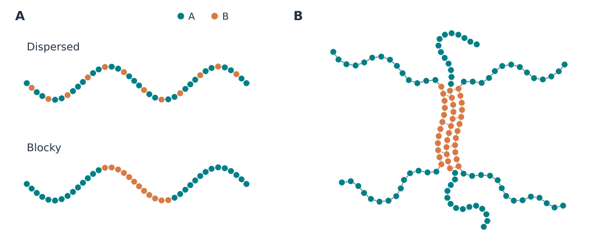
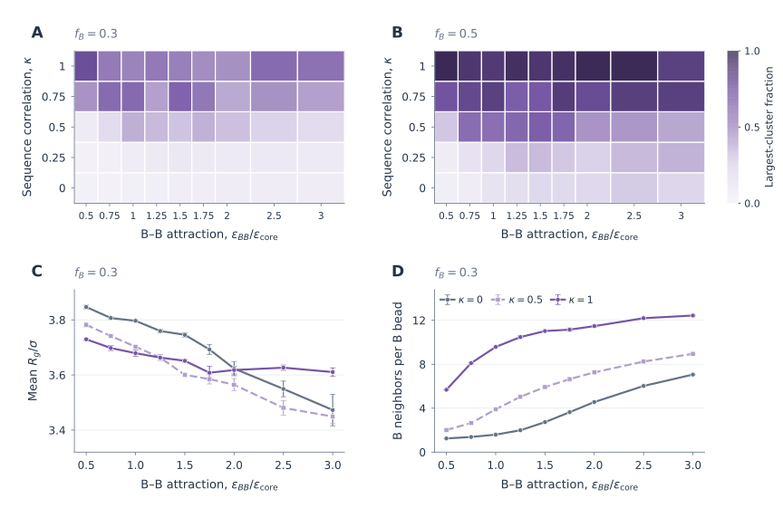
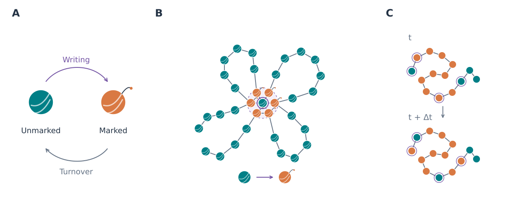
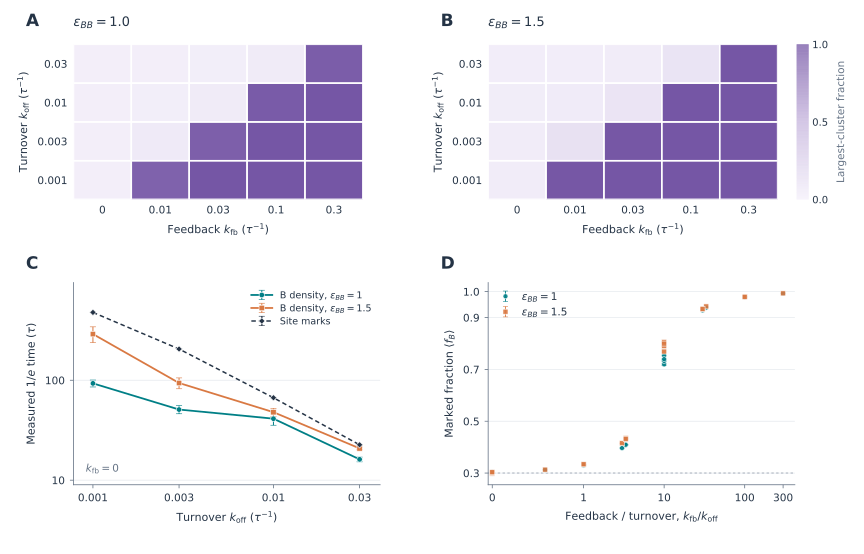

# ImpAgingSim

Sequence correlations as a design axis for microphase structure in A/B heteropolymer melts. 

The central study asks: if you hold composition, chemistry, chain
length and density fixed, and change only how **correlated the A/B pattern is
along the backbone**, how much does the microphase structure of the melt
change? The answer is that it changes by roughly two orders of magnitude in
the composition structure factor peak, and that a one chain sequence statistic
predicts most of it.

Sections 1-3 describe the model and the paper's results. Section 4 examines
finite-time mixing–demixing crossovers and their dependence on
sequence correlation, the composition dynamic structure factor for comparison
with theory, and two applications of the model with asymmetric energetics,
sequence-programmed condensation of copolymers and epigenetic memory in a
chromatin fiber with dynamic marks. Every study has a findings note under
[`analysis/`](analysis/README.md).

All simulation data is archived on Zenodo: the melt archive at
**[10.5281/zenodo.20499120](https://doi.org/10.5281/zenodo.20499120)**
(concept DOI, always resolves to the newest version, currently 4.0.0), the
copolymer condensation dataset at
[10.5281/zenodo.22819768](https://doi.org/10.5281/zenodo.22819768) and the
chromatin epigenetic-memory dataset at
[10.5281/zenodo.22819770](https://doi.org/10.5281/zenodo.22819770). See
[Data availability](#data-availability).

---

## 1. The model

A melt of `M` chains, each `N` beads, in a cubic periodic box. Every bead
carries a binary label A or B. Langevin dynamics in OpenMM on GPU.


**Figure 1. Bead-spring geometry.** Panel A shows a chain with harmonic bonds;
panel B shows a schematic melt. Teal and orange denote A and B. The highlighted
segment repeats across a periodic boundary separated by $L=22\sigma$.
Production systems contain 144 chains of 40 beads.

### 1.1 The sequence construction

Two parameters generate the sequence. A Markov backbone sets the **range** of
correlation, and a Bernoulli mask sets its **amplitude**.


**Figure 2. Sequence construction.** In panel A, $b_i=1$ keeps the Markov
backbone label and $b_i=0$ redraws independently at the same mean A fraction:
$\psi_i=b_i z_i+(1-b_i)u_i$, with $\Pr(b_i=1)=\kappa$. A redraw can retain
the original species. Panel B separates amplitude from range. For the
unconditioned generator, the normalized connected covariance is $\Gamma(0)=1$ and
$\Gamma(\ell)=\kappa^2(2\pi-1)^\ell$ for $\ell\geq1$. The plotted values
illustrate amplitude and range separately; they are analytic, not simulation data.

Consequences of this construction:

- `kappa = 0` gives an independent random copolymer.
- `kappa = 1` gives the fully correlated Markov sequence.
- The lag zero variance stays independent of kappa, so the random sequence
  limit is preserved.
- At positive lag, the normalized connected sequence autocorrelation is
  `kappa^2 * lambda^ell`, with `lambda = 2*pi - 1`.
- Mean composition `f_A`, chemistry, density and chain length are all held
  fixed while kappa varies. Only the covariance between labels along the chain
  changes.

The ordinary generator draws chains independently and fixes composition in
expectation. A Markov state never propagates across a chain boundary. The
optional exact-total generator, used by the fixed-density campaign, conditions
these draws on the global A count.

### 1.2 The interaction potential

The nonbonded potential is split so that excluded volume is universal and
incompatibility is pair specific. This matters, because a single Lennard-Jones
term with a reduced `eps_AB` would weaken the A/B attraction and remove A/B
excluded volume at the same time, which confounds the interaction scan.


**Figure 3. Implemented nonbonded energy.** Panel A identifies pair types and
attraction strengths; panel B shows their energies. The WCA core is common to
all pairs. Attraction begins at $r_m=2^{1/6}\sigma$ and is shifted to zero at
$r_c=2.5\sigma$. Open and filled endpoints show the energy jump at $r_m$
caused by the current step-gated tail. Adjacent bonded beads are excluded
from both nonbonded terms.

| pair | eps | meaning |
|---|---|---|
| A-A | 1.0 | strong attraction |
| B-B | 1.0 | strong attraction |
| A-B | 0.1 | weak attraction, drives demixing |

Like attracts like, unlike barely attracts. Chain connectivity frustrates full
macrophase separation, so the melt forms microphases at a finite length scale.

The two pieces live in separate OpenMM force groups, implemented in
`melt/integrator.py`.

### 1.3 Simulation parameters

| quantity | value |
|---|---|
| chains x beads | 144 x 40 = 5,760 |
| box length | 22 sigma |
| number density | 0.541 sigma^-3 |
| quench temperature | T* = k_B T / eps = 0.7, mapped to 84.19 K |
| equilibration temperature | T* = 5.0 |
| integrator | Langevin middle, friction 1/tau, dt = 0.005 tau |
| bonds | harmonic, equilibrium length sigma |
| LJ cutoff | 2.5 sigma |
| production | 250,000 steps, snapshot every 2,000 |

Temperatures are set in kelvin using `k_B = 0.0083144626 kJ/mol/K` so that the
reduced temperature is exactly what the model intends. A regression test
asserts that T* = 0.7 maps to 84.187 K.

Initial configurations are independent random walks, then repaired by
`melt.box.relax_overlaps` before minimization. Without that repair, beads can
land about 0.007 sigma apart, and the r^-12 core puts roughly 1e25 into a
single contact, which the energy minimizer cannot always recover from. Six of
thirty runs in an early fixed density campaign diverged this way before the
repair existed.

---

## 2. What is measured

### 2.1 Static structure

The composition structure factor, taken at equal time:

$$
S_{\psi\psi}(k)=S_{AA}(k)+S_{BB}(k)-2S_{AB}(k).
$$

This combination is invariant under relabelling A and B. Its peak defines the
contrast `C`. A resolved peak wavevector gives a characteristic spacing
$\xi=2\pi/k^*$; a maximum at the lowest sampled wavevector is limited by the box.


**Figure 4. Measured static structure.** Panel A shows 144 chains; panel B
compares three system sizes at fixed density. All use 40 beads per chain,
$f_A=0.5$, $\pi=0.99$, and $T^*=0.7$. The direct reciprocal-shell
estimator uses the total-bead-normalized channel $S_{\psi\psi}^{(N)}/2$.
Bands and bars show mean ± SEM across five independent seeds, each averaging
its final five saved configurations. At $\kappa=1$, the two smaller boxes peak
at their lowest sampled wavevector, $k_{\min}=2\pi/L$.
[Figure sources and regeneration](docs/figures/README.md).

Away from `f_A = 1/2` this combination mixes total density and composition
modes. The density orthogonal quantity is the Bhatia-Thornton mode
`S_cc = (1-f_A)^2 S_AA + f_A^2 S_BB - 2 f_A (1-f_A) S_AB`. Off stoichiometric
conclusions were withdrawn for this reason.

### 2.2 Dynamics

Implemented in `melt/dynamics.py`, computed from stored per bead trajectories
with periodic unwrapping:

| observable | definition |
|---|---|
| `F_s(k, t)` | self intermediate scattering function |
| `tau_alpha` | first interpolated time where `F_s = 1/e` |
| `Q(t)` | self overlap, fraction of beads within `a = 0.3 sigma` of their start |
| `chi_4(t)` | `N * Var_seeds[Q(t)]`, N being the bead count |
| `MSD` | mean square displacement |
| `alpha_2` | non Gaussian parameter |

The `chi_4` prefactor is the system size in beads. An earlier version used the
number of realizations, which underestimated the amplitude by a factor of
`N / n_runs`, about 1920 for the production geometry. A regression test pins
the normalization.

---

## 3. Results

### 3.1 Sequence correlation amplifies contrast

Raising kappa from 0 to 1 at fixed chemistry and composition:

| control | amplification of peak contrast |
|---|---|
| baseline | 18.7x |
| dense (L = 17 sigma) | 11.9x |
| soft (all attractions x 0.4) | 15.0x |
| short chain (N = 12) | 15.0x |

The domain length grows by a common factor of 2.33 across all four scans, and
the potential energy falls with kappa, consistent with more like-like contacts.

### 3.2 A one chain statistic predicts it

The finite chain intramolecular composition form factor for a Gaussian
reference chain with segment length `b`:

$$
\frac{S_0(k)}{4f_A(1-f_A)}
=1+2\kappa^2\sum_{\ell=1}^{N-1}
\left(1-\frac{\ell}{N}\right)\lambda^\ell
\exp\!\left(-\frac{k^2b^2\ell}{6}\right).
$$

Plotting excess contrast against this predictor collapses the data with
logarithmic slope 1.02 and R^2 = 0.80. The melt amplifies a bare one chain
statistic. This is the same object that RPA and SCFT are built on, with
`eps_AB` playing the role of the Flory-Huggins `chi`.

### 3.3 Composition

The symmetric peak is largest at balanced composition, amplified 23.9x between
kappa = 0 and kappa = 1 at `f_A = 0.5`. Away from balance the minority species
caps the available composition variance.

### 3.4 Cross attraction

Contrast is non monotonic in `eps_AB`. The small `eps_AB` interval reads as a
broad plateau, and the earlier claim of a resolved optimum there was withdrawn. A blocked permutation test over the correlated
sequence values at `eps_AB <= 0.2` gives Q = 6.0667 and p = 0.5626, so the
interval is unresolved. Driving `eps_AB` to zero makes the melt lose cohesion
and break into globules, so it stops producing a clean microphase pattern.

### 3.5 Dynamics slow without a clean aging law

Relaxation slows with kappa and `chi_4` rises, so the correlated melt relaxes
more slowly and more heterogeneously. Relaxation times do not grow
monotonically with waiting time, and static contrast shows no consistent drift
over 1e6 to 1e8 steps, so the stored trajectories do not establish a waiting
time dependent glass transition.

Measured at each condition's own peak wavevector, the kappa = 1 to kappa = 0
ratio of `tau_alpha` is about 6.2. At a common `k = 1/sigma` it falls to about
1.9. Part of the apparent slowdown therefore reflects the larger length scale being
probed, so the structural relaxation slows more than the local bead motion does.

### 3.6 Finite size

A fixed density series at `M = 144 / 288 / 576` chains, with
`L(M) = 22 (M/144)^(1/3)` so bead density and mesh spacing stay constant,
five seeds per condition, 30 runs total. Entries are selected peak
$S_{\psi\psi}^{(N)}/2$, mean ± SEM, as plotted in Figure 4B:

| M | L (sigma) | kappa = 0 | kappa = 1 |
|---|---|---|---|
| 144 | 22.00 | 6.23 +/- 1.22 | 541 +/- 13 |
| 288 | 27.72 | 6.60 +/- 0.75 | 773 +/- 59 |
| 576 | 34.92 | 6.83 +/- 1.25 | 575 +/- 40 |

Peak amplification ranges from 84× to 117× across these sizes. At kappa = 0,
the endpoint amplitudes differ by about 10%. At kappa = 1, the M = 144 and
M = 576 amplitudes differ by 0.83 combined SEM, with a higher intermediate
value. The correlated peak occurs at $k_{\min}=2\pi/L$ in the two smaller
boxes and at $\sqrt{2}k_{\min}$ in the largest. This series therefore does
not establish a size-independent domain length.

### 3.6a Correction to the RPA treatment (September 2026)

The published RPA discussion presented the scalar composition equation
without the matrix theory and symmetry assumptions that justify it, and it
read an uncalibrated bare interaction integral as a physical stability
result. The correction (`docs/corrections/scientific_reports_rpa/`) keeps
RPA as an explicitly approximate homogeneous-reference framework: the
balanced Gaussian intrachain matrix `Omega(k)` and the compressible closure
`Gamma = Omega^-1 + B(k) J + rho beta w(k) E` are derived
(`melt/rpa_matrix.py`), the density and composition modes decouple under
A/B exchange symmetry to `S_psipsi^-1 = S_0^-1 - chi_bare/2`, and the
formal `q -> 0` value `chi_bare = 9.499` is stated as a failure of the bare
homogeneous closure rather than as the melt's spinodal. No simulation was
rerun; the four predictor-fit `R^2` values and the finite-wavevector slope
(0.1988, `R^2 = 0.8956`) are unchanged. `scripts/submission_rpa_audit.py`
reproduces every number from the published source tables
(`analysis/submission_rpa/`); the corrected manuscript, supplementary and
response-to-reviewer sources and PDFs are in the correction directory, and
the updated supplementary data package is version 4.1.0 of the Zenodo record.

### 3.7 What is deliberately not claimed

The data does not establish an order-disorder transition, a universal density
exponent, or a glassy aging transition. The finite box admits a discrete set of
wavevectors, the density scans mix overlap and scattering amplitude changes,
and locating an ODT would require a temperature or `eps_AB` scan with finite
size scaling and Binder cumulants across several box sizes.

---

## 4. Incompatibility, dynamics and biological applications

Two extensions take the model to the next question: at what A/B
incompatibility does the melt cross from mixed to demixed at fixed sequence
correlation, and how does the composition pattern relax in time.

### 4.1 Dictionary to the field theory

| simulation | field theory |
|---|---|
| `kappa` and `pi` | positive-lag covariance amplitude `kappa²` and decay factor `lambda = 2*pi - 1`, respectively |
| `eps_AB` at fixed `eps_AA = eps_BB = 1` | the Flory-Huggins `chi`; the incompatibility axis is `delta_eps = 1 - eps_AB` |
| `eps_AB = 1` | `chi = 0`: every pair interacts identically, entropy of mixing wins |
| `eps_AB = 0.1` | the strongly demixed production value of sections 1-3 |

Because the WCA core is shared by all pairs, lowering `eps_AB` weakens the A-B
attraction without touching excluded volume, so the sweep is a clean
incompatibility knob. The bridge `chi = alpha (1 - eps_AB) / T*` has one
unknown, the effective contact number `alpha`, which `melt.rpa` fits from the
mixed side of the sweep where mean-field theory applies.

### 4.2 The sweep (`melt.epsab_scan`)

Everything is held at the production protocol (144 x 40 beads, `L = 22`,
`kappa = 0.5`, `pi = 0.99`, `f_A = 1/2`, exact global composition,
`T* = 0.7`, 30,000 equilibration steps at `T* = 5`, 250,000 production steps)
and only `eps_AB` moves: 37 values from 1.0 down to 0.1 in steps of 0.025,
four seeds each, 148 runs. The dense grid resolves the finite-time crossover without assuming its
location or sharpness;
a second stage refines the bracketed interval with a finer list, more seeds
and a second box size under a new campaign id.

Every run records the exact Fourier amplitudes of the A and B bead densities
at all periodic-box modes with `|q| <= 1.5 / sigma` (618 modes in 24 shells
for `L = 22`) every 200 steps, so 1,250 frames per run. The evaluation uses
the per-axis factorization of `exp(i q . r)` for integer box modes and is
exact; recording leaves the seeded trajectory bit-identical.

### 4.3 What is measured

Static, from the trailing half of production (the analysis window):

| observable | definition | reads |
|---|---|---|
| `S_psi(q*)` | time-averaged peak of `S_AA + S_BB - 2 S_AB` | amplitude of composition fluctuations |
| coarse-grained variance | `(1/N) sum_q S_psi(q) exp(-q^2 l^2)` | real-space composition fluctuation at scale `l` |
| peak-intensity variance | `Var_t[S_psi(q*, t)] / <S_psi(q*)>^2` | fluctuations of the fluctuations; spikes at a transition |
| non-Gaussianity ratio | `<|rho_psi(q*)|^4> / <|rho_psi(q*)|^2>^2` | 2 for Gaussian (mixed) amplitudes, 1 for a frozen pattern |
| seed variance of `S_psi(q*)` | relative variance across seeds | disorder-to-disorder susceptibility |

Composition dynamics are measured by the two-time structure factor:

$$
S_{\psi\psi}(q,\tau)=\frac{1}{N}\left\langle \rho_\psi(q,t_0)\,\rho_\psi^*(q,t_0+\tau)\right\rangle_{t_0,\ |q|\in\text{shell}},
\qquad F(q,\tau)=\frac{S(q,\tau)}{S(q,0)} .
$$

It is computed for every shell by the Wiener-Khinchin identity over all time
origins in the window, together with the total-density channel
`rho_A + rho_B`. Time means are not subtracted, so an arrested pattern
appears as a plateau in `F(q, tau -> inf)` rather than being removed. Per
shell the analysis reports the `1/e` relaxation time, the short-time decay
rate from `-ln F`, a stretched-exponential fit and the late-lag plateau.

### 4.4 Locating the finite-time crossover

`melt.epsab_analysis` aggregates a campaign into per-run and per-condition
tables (mean and SEM over seeds), spectra and `F(q*, tau)` per condition,
and `transition_summary.json` with five estimators of the transition along
`delta_eps`, each with a seed bootstrap: the maximum of the peak-intensity
variance, the maximum of the seed variance, the steepest rise of
`ln S_psi(q*)`, the steepest rise of the coarse-grained variance, and the
crossing of the non-Gaussianity ratio through 1.5. The same file holds the
RPA comparison: `alpha`, the fitted `chi(eps_AB)`, the predicted spinodal
`eps_AB` and the mean-field `S(q*)` curve that the figures overlay on the
simulation.

The RPA used is the incompressible one-component form in the simulation's
normalization, `S^{-1} = S_0^{-1} - chi/2`, with `S_0(q)` the finite-chain
composition form factor of section 3.2 and the segment length taken from the
measured `R_g` at `eps_AB = 1`. For a symmetric blend it reproduces
`chi_s N = 2`.

### 4.5 Results of the sweep program

The melt extension comprises 15 campaigns and 1,072 production runs, using
the 144 × 40 geometry unless stated. Tables and study notes are under
[`analysis/`](analysis/README.md); raw output is in the melt archive, version 4.
The two biological applications below add 520 runs in separate Zenodo records.

**The chi = 0 reference is mixed.** At `eps_AB = 1` the composition spectrum
is flat, `S_psi(q) = 3-5`, of the same order as the ideal single-chain form factor
(`S_0(q_min) = 6.9` for `b = 1.24 sigma`). [`analysis/epsab_stage1/`]

**Finite-time crossover at kappa = 0.5, T* = 0.7.** `eps_AB = 0.85 +/- 0.03`
(`delta_eps = 0.15`), from the half-rise of `S_psi(q*)` over a 25-point grid
with eight seeds; the 144- and 288-chain boxes agree at every point. The
mean-field spinodal fitted on the mixed side is at `eps_AB = 0.905` with a
contact factor `alpha ~ 2.0`, so the melt demixes about 50% deeper in
incompatibility than the RPA instability. The microphase peak stays at
`q* = 0.4-0.5 / sigma` (domain spacing ~14 sigma) in both boxes and is still
coarsening slowly after 1M steps. [`analysis/epsab_stage1/`, `analysis/epsab_stage2/`]

**The dynamic structure factor needs an ergodic melt.** At `T* = 0.7` no
composition mode below `q ~ 0.5 / sigma` relaxes even in a 6,250-tau window.
At the `chi = 0` reference, raising `T*` to 1.5 or 2.0 makes shell
relaxation measurable. At `T* = 1.5`, relaxation times fall from about
1,700 tau at `q = 0.29` to 60 tau at `q = 1.0`, with an approximately
Rouse-like `q^-4` regime. Low-wavevector modes slow toward the crossover
and can again outlast the measurement window. Plotting `S_psi(q*)` against
`delta_eps / T*` gives an approximate collapse across the sampled
temperatures, consistent with a common incompatibility scaling.
[`analysis/dsf_series/`](analysis/dsf_series/)

**Sequence correlation shifts the crossover.** At `T* = 1.5`, an
uncorrelated copolymer (`kappa = 0`) remains weakly structured over the sampled range
(`S_psi(q*) <= 3`, Gaussian amplitudes); `kappa = 0.25` reaches 13; from
`kappa = 0.5` a pronounced crossover appears at `delta_eps_c` = 0.20, 0.15, 0.115
for `kappa` = 0.5, 0.75, 1 with plateau amplitudes of 120, 500, 1020. The RPA
spinodal reproduces the trend, matches at `kappa = 0.5`, and sits at about
half the simulated value for `kappa >= 0.75`. A strongly anisotropic low-wavevector pattern, with shell anisotropy
approaching 3, is observed for `kappa = 1` at `delta_eps >= 0.7`. This is
compatible with lamellar ordering, but finite-time data in these boxes do
not establish two thermodynamic phase transitions.
[`analysis/kappa_boundary/`](analysis/kappa_boundary/)

**The theory-comparison dataset.** At `T* = 1.5` and `2.0`, mixed side
(`eps_AB` 1.0 to 0.85), eight seeds, 5M steps with box modes every tau: at
chi = 0 the composition relaxation is a single exponential with
`tau ~ q^-3.9` above `q R_g ~ 1.8` (Rouse); toward the crossover the `q_min`
mode's amplitude grows eightfold and its rate falls sixfold while every mode
with `q >= 0.8` keeps its chi = 0 relaxation time, so `Gamma(q) S(q)` is
approximately constant (thermodynamic slowing with a fixed kinetic
coefficient); relaxation times level off near 3,000 tau below `q ~ 0.3` in
both the 144- and 288-chain boxes; and the chi = 0 times are 2.2x shorter at
`T* = 2.0` than at 1.5, more than the 1.33x of a purely thermal mobility.
[`analysis/dsf_theory/`]

**Coarsening at T* = 0.7.** Runs extending to 100,000 tau show continued
growth after quenches near the crossover (`eps_AB = 0.8, 0.7`): peak
intensity grows approximately as `t^0.5` over the final fitted decade,
while the peak moves toward lower wavevectors. The deeper quench
(`eps_AB = 0.5`) has much slower intensity growth and smaller characteristic
spacing; its peak still drifts, so it is not a completely frozen pattern.
[`analysis/coarsening/`](analysis/coarsening/)

### 4.6 A common model for two biological applications

The applications use asymmetric interactions: B–B attraction, purely
repulsive A–A and A–B interactions, and a shared WCA core. Both contain
144 chains of 40 beads at density $0.2\sigma^{-3}$, $T^*=1$, and
$\pi=0.99$. The lower density leaves free volume for B-rich clusters to
form. Solvent is implicit.

[`melt.condensate_scan`](melt/condensate_scan.py) runs both campaigns.
[`melt.clusters`](melt/clusters.py) identifies connected components of the
B-contact graph using periodic distances within $1.5\sigma$, including
bonded neighbors. The largest-cluster fraction measures connectivity;
B–B coordination measures local packing. Neither quantity alone identifies
an equilibrium phase boundary or whether contacts are within one chain.

### 4.7 Protein-inspired design: sequence pattern and association

Fixed A/B labels represent polar and hydrophobic segments. The study tests
how their arrangement controls collective association at fixed composition,
using a minimal copolymer model rather than amino-acid-specific chemistry.



**Figure 5. Patterning the attractive segments.** A compares schematic
40-bead sequences with the same 12 B beads. B illustrates how attractive
segments on different chains can share a contact region while A-rich tails
remain outside. Teal denotes A, orange B; thin contact dashes are distinct
from backbone bonds. These are explanatory drawings, not trajectory snapshots
or classifications assigned to individual simulated chains.

The campaign varies $\epsilon_{BB}$ from 0.5 to 3, $\kappa$ from 0 to 1,
and the B fraction between 0.3 and 0.5: 90 conditions, four seeds each,
360 runs, each lasting 5,000 tau.



**Figure 6. Sequence-dependent cluster organization.** A–B show the fraction
of B beads in the largest contact cluster at each sampled condition.
C–D show mean chain radius of gyration and mean B-neighbor count at
$f_B=0.3$. Each run contributes its trailing-half mean (250 samples);
error bars are SEM over four seeds. Heatmap cells show measured condition
means without a fitted boundary. [Source tables](analysis/protein_condensation/per_condition.csv)
and [regeneration details](docs/figures/README.md).

**Sequence correlation promotes larger connected clusters.** At $f_B=0.3$
and $\epsilon_{BB}=0.5$, the largest cluster holds about 1% of B for
$\kappa=0$, compared with 79% for $\kappa=1$. Attraction also matters:
at $\kappa=0.5$, this fraction rises from 6% to 38% as
$\epsilon_{BB}$ increases from 0.5 to 1, then falls to 21% at 3.
The response is therefore a joint effect of pattern, composition and attraction.

**Local packing and collective connectivity are distinct.** For uncorrelated
chains at $f_B=0.3$, increasing $\epsilon_{BB}$ from 0.5 to 3 raises
B–B coordination from 1.24 to 7.06, while the largest cluster still contains
only 6% of B. Mean $R_g$ decreases by 9.7%, compared with 3.2% for
$\kappa=1$. These observations establish different organization and chain
size responses; they do not establish exclusively single-chain collapse.
For protein engineering, the model motivates controlling the distribution
of attractive segments as well as their abundance and strength.

[Study details](analysis/protein_condensation/README.md) ·
[Archived dataset](https://doi.org/10.5281/zenodo.22819768)

### 4.8 Chromatin-inspired memory: dynamic marks and spatial feedback

A and B now represent unmarked and marked chromatin beads. Reader-mediated
attraction is represented by the effective B–B potential; writer recruitment
is represented by a local mark-conversion rule. Reader and writer proteins
are not explicit particles.



**Figure 7. Coupling mark state to spatial organization.** A shows reversible
mark writing and turnover. B shows how folding brings marked segments close
to a target site: the dashed circle is its local neighborhood, and purple
contact cues indicate contributions to feedback. C distinguishes spatial
organization from site identity; outlined sites switch state while a similar
B-rich pattern remains. Geometry is illustrative and held fixed in C to
isolate that distinction. Nucleosome motifs convey the biological analogy;
the simulated particles are spherical beads.

Every 2 tau, marks are updated using the rates

$$
B\xrightarrow{k_{\mathrm{off}}}A,
\qquad
A\xrightarrow{k_{\mathrm{on}}+k_{\mathrm{fb}}H(n_B)}B,
\qquad
H(n_B)=\frac{n_B^2}{n_B^2+6^2}.
$$

Here $n_B$ counts marked neighbors within $1.5\sigma$;
$k_{\mathrm{on}}=k_{\mathrm{off}}(0.3/0.7)$ sets the no-feedback
continuous-time reference fraction to 0.3. The implementation converts
rates to finite-interval switching probabilities. The campaign scans
turnover and feedback at $\epsilon_{BB}=1$ and 1.5, starting from
$f_B=0.3$ and $\kappa=0.5$: 40 conditions, four seeds each,
160 runs of 12,500 tau. Full mark histories are recorded in `marks.npz`.



**Figure 8. Collective organization under mark turnover.** A pairs the two
attractions in each cell: upper-left $\epsilon_{BB}=1$, lower-right 1.5;
color shows the largest marked-cluster fraction. B compares B-density and
site-mark $1/e$ times at $k_{\mathrm{off}}=0.01\tau^{-1}$ and
$\epsilon_{BB}=1.5$. Upward arrows mark no density crossing in any of four
seeds before the 3,122.5-tau lag limit; they are lower bounds, not finite
estimates. C shows correlation times without feedback (site-mark curve at
$\epsilon_{BB}=1$). Density times use each run's spectral peak; site-mark
correlations subtract each site's time mean. D shows marked fraction for
every condition, without a ratio-only fit. Means and SEM use four seeds,
each analyzed over its final 6,250 tau.
[Source tables](analysis/chromatin_memory/per_condition.csv) and
[regeneration details](docs/figures/README.md).

**Without feedback, density correlations decay faster as turnover increases.**
The measured B-density relaxation times span 16–290 tau. These are collective
decorrelation times, not tracked lifetimes of individual clusters. The
site-mark times also decrease with turnover; finite-window estimates need
not equal the infinite-time independent-switching prediction
$1/(k_{\mathrm{on}}+k_{\mathrm{off}})$.

**Feedback sustains density organization while individual marks turn over.**
At sampled $k_{\mathrm{fb}}/k_{\mathrm{off}}=10$, the largest cluster
contains 94–100% of the marked beads, compared with about 13% or less at sampled
ratios up to 3.33. In the strong-feedback regime, B-density correlations do
not cross $1/e$ within the evaluated lag range (up to 3,122.5 tau), even
though site marks continue to change. This is persistence of a collective
pattern in the model, not evidence of inheritance through cell division.

**Feedback also expands the marked population.** Mean $f_B$ reaches
0.72–0.81 at ratio 10, about 0.93 at ratios near 30, and 0.98–0.99 at
100–300. The rate ratio organizes the response but does not determine it
exactly. Strong feedback thus approaches global marking rather than
selecting a bounded domain, motivating additional regulation in extensions
of this minimal model.

[Study details](analysis/chromatin_memory/README.md) ·
[Archived dataset](https://doi.org/10.5281/zenodo.22819770)

---

## 5. Repository layout

```
melt/                       the simulation engine
  integrator.py             OpenMM system: bonds, WCA core, pair specific tail
  sequences.py              Markov backbone plus Bernoulli mask generator
  box.py                    chain placement and overlap repair
  observables.py            structure factors and peak extraction
  density.py                density fields on a grid
  density_slice.py          high resolution real space slices
  direct_structure.py       direct reciprocal shell estimator
  dynamics.py               F_s, MSD, alpha_2, Q, chi_4, tau_alpha
  twotime.py                two time correlation helpers
  modes.py                  exact box-mode amplitudes rho_A(q,t), rho_B(q,t) recorder
  dynamic_structure.py      S(q,tau), F(q,tau) and static fluctuation observables
  rpa.py                    finite-chain S_0(q), RPA S(q), spinodal, eps_AB -> chi bridge
  rpa_matrix.py             matrix (density + composition) RPA with the compressible closure
  run.py                    single run driver
  scan.py  kappa_scan.py  temperature_scan.py  big_run.py
  campaign.py               shared restartable-campaign machinery (manifest, hashes, locks)
  epsab_scan.py             eps_AB sweep at fixed kappa, shardable and parallel
  epsab_analysis.py         sweep aggregation, transition estimators, RPA comparison, figures
  marks.py                  dynamic epigenetic marks: turnover, writing, reader-writer feedback
  clusters.py               B contact clusters and local-density condensation observables
  condensate_scan.py        protein (quenched) and chromatin (dynamic-mark) condensation campaigns
  condensate_analysis.py    condensation aggregation, blob lifetime, mark memory, phase diagrams
  fixed_density_size_scan.py    fixed density campaign driver
  fixed_density_analysis.py     deterministic aggregation for that campaign
  analyze.py  deep_analysis.py  viz.py  io.py  model.py

docs/figures/              README SVGs, PNG exports, and figure provenance
docs/corrections/          Scientific Reports RPA correction: revised sources, PDFs, audit, response
scripts/render_*          reproducible README figure generators
scripts/submission_rpa_audit.py   reproduce the RPA correction's numbers from the source tables
scripts/fetch_zenodo.py    download and verify the Zenodo archive
scripts/modes_from_trajectory.py   archived trajectory.npz -> mode_amplitudes.npz
analysis/                   derived tables and figures, one directory per study; see analysis/README.md
analysis_aws/               AWS campaign tables of the paper
aws/                        EC2 campaign scripts, see aws/README.md
sherlock/                   SLURM kit for Stanford Sherlock, see sherlock/README.md
tests/                      138 tests across melt, fixed density, modes, RPA, sweeps, marks and condensation
output/                     run outputs, large directories are gitignored
archive/single_chain_mc/    superseded code, see below
```

### archive/single_chain_mc/

The original single chain Metropolis Monte Carlo study of the IMP
heteropolymer, using pair specific quenched disorder `eta_ij` and contact
overlap observables. It preceded the multi chain off lattice melt model and is
superseded by `melt/`. The code is kept so the earlier numbers stay
reproducible, and its outputs live in `output/results.csv`,
`output/results_extended.csv` and `output/robustness/`. New work belongs in
`melt/`.

The Obsidian vault in `obsidian-notes/` is local only and is gitignored.

---

## 6. Running it

### Single run

```bash
python3 -m melt.run \
  --out output/melt/demo --run_id k1.0 \
  --sequence correlated --kappa 1.0 --pi 0.99 --f_A 0.5 \
  --n_chains 144 --chain_length 40 --box_size 22.0 \
  --T_equilibrate 5.0 --T_quench 0.7 --lj_eps_AB 0.1 \
  --equilibration 30000 --n_steps 250000 --snapshot_interval 2000 \
  --compute_density --grid_size 56 --save_trajectory \
  --seed 1 --platform CUDA
```

Runs are idempotent. Re-invoking skips any run whose `structure_factor.npz`
already exists.

### Fixed density campaign

```bash
python3 -m melt.fixed_density_size_scan --dry-run              # print the 30 run plan
python3 -m melt.fixed_density_size_scan --manifest-only --platform CUDA
python3 -m melt.fixed_density_size_scan --run --platform CUDA
python3 -m melt.fixed_density_size_scan --analyze --platform CUDA
```

Each run is staged, hashed, then atomically promoted, so re-running verifies
hashes and skips completed work. A campaign is pinned to its creation commit
and requires a clean git tree. For a scheduler array, create the manifest once
and pass `--run-index "$SLURM_ARRAY_TASK_ID"`.

### eps_AB sweep

```bash
python3 -m melt.epsab_scan --dry-run                                  # 148-run plan
python3 -m melt.epsab_scan --manifest-only --out $OUT --campaign-id epsab_kappa05
python3 -m melt.epsab_scan --run --out $OUT --campaign-id epsab_kappa05 --platform CUDA
python3 -m melt.epsab_scan --status --out $OUT --campaign-id epsab_kappa05
python3 -m melt.epsab_scan --analyze --out $OUT --campaign-id epsab_kappa05
```

`--shard-index K --shard-count S` runs every plan index congruent to `K`
modulo `S` (one shard per scheduler array task); `--parallel P
--threads-per-run T` runs `P` runs at once as subprocesses on a many-core
machine. Both share one campaign directory safely through per-run locks.
`$OUT` must be outside the git tree, since a campaign requires a clean tree.
Stage 2 uses a new `--campaign-id` with a finer `--eps-ABs` list, more
`--seeds` and `--sizes 144 288`. Any run's two-time correlations can also be
inspected directly:

```bash
python3 -m melt.dynamic_structure $OUT/epsab_kappa05/runs/M0144_N40_kappa0p5_pi0p990_epsAB0p5_seed1
python3 scripts/modes_from_trajectory.py --analyze path/to/archived_run   # from a trajectory.npz
```

### Tests

```bash
python3 -m pytest tests/ -v
```

The suite covers reduced unit temperature conversion, force group separation in
the nonbonded potential, independent per chain sequence generation under the
unified `lambda = 2 pi - 1` generator, symmetric composition structure factors,
and the `chi_4 = N Var(Q)` normalization.

### AWS

Campaigns run on EC2 GPU instances. See [`aws/README.md`](aws/README.md) for
provisioning, campaign kinds, cost and teardown. Dispatch is by `SCAN_KIND`:

```bash
S3_BUCKET=your-bucket INSTANCE_TYPE=g5.2xlarge \
GIT_REF=master SCAN_KIND=fixed_density ./aws/launch.sh
```

Available kinds: `smoke`, `kappa`, `temperature`, `big`, `rerun`,
`seed_extension`, `fixed_density`, `all`.

### Sherlock

The `eps_AB` sweep runs on Stanford's Sherlock cluster as a GPU job array.
[`sherlock/README.md`](sherlock/README.md) walks through the SSH setup, the
one-time environment (`python` module plus a pip-installed `openmm[cuda12]`
virtualenv; Sherlock advises against conda), the smoke test, the array
submission, monitoring, and pulling results back through the data transfer
nodes.

---

## Data availability

The repository holds the code and small derived tables. The raw simulation
output is too large for git and lives on Zenodo.

**DOI [10.5281/zenodo.20499120](https://doi.org/10.5281/zenodo.20499120)**
(concept DOI, resolves to the newest version, currently 4.0.0)

| file | size | contents |
|---|---|---|
| `sweep_*.tar` (five archives) | 39 GB | [version 4.0.0] all fifteen `eps_AB` sweep, temperature, kappa and coarsening campaigns of section 4: per run `mode_amplitudes.npz` (exact box modes for the dynamic structure factor), `snapshots.csv`, `structure_factor.npz`, `meta.json`, hashed `completion.json`; per campaign `manifest.json` and the `analysis/` tables and figures |
| `heteropolymer_microphase_data.tar` | 3,328 MB | full raw output of the production campaigns, mirroring the AWS results bucket. Per run `meta.json`, `snapshots.csv`, `structure_factor.npz`, and `trajectory.npz` where applicable |
| `complete_local_archive.tar` | 106 MB | the earlier single chain study, robustness sweeps, development runs, manuscript builds and working notes |
| `fixed_density_campaign.tar` | 37 MB | the 30 run fixed density finite size study, plus the superseded first execution kept for provenance |
| `Supplementary_Data_1_source_tables.zip` | 25 MB | per figure source and sensitivity tables, plus figure generation scripts |

The protein and chromatin applications are archived in separate records:

| record | DOI | contents |
|---|---|---|
| Sequence-programmed condensation of A/B copolymers | [10.5281/zenodo.22819768](https://doi.org/10.5281/zenodo.22819768) | `protein_condensation_data.tar` (14.5 GB): the 360-run `eps_BB` x `kappa` x composition campaign with cluster statistics, box modes and analysis |
| Epigenetic memory in a copolymer model of chromatin | [10.5281/zenodo.22819770](https://doi.org/10.5281/zenodo.22819770) | `chromatin_memory_data.tar` (13.5 GB): the 160-run `k_off` x `k_fb` campaign with full mark histories (`marks.npz`), cluster statistics, box modes and analysis |

A fresh clone gives you the code and the derived tables. Reproducing figures
from raw trajectories requires pulling the tarballs from the DOI:
`python scripts/fetch_zenodo.py --only sweep_kappa_boundary_and_coarsening.tar`
downloads and checksum-verifies a file; `scripts/publish_zenodo.py` creates
the next version (token via `ZENODO_TOKEN`).
