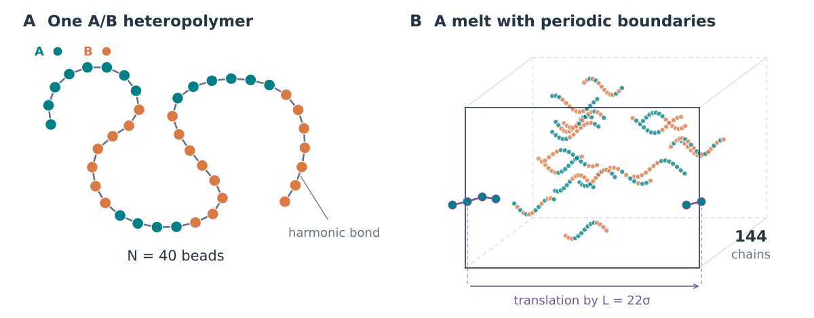
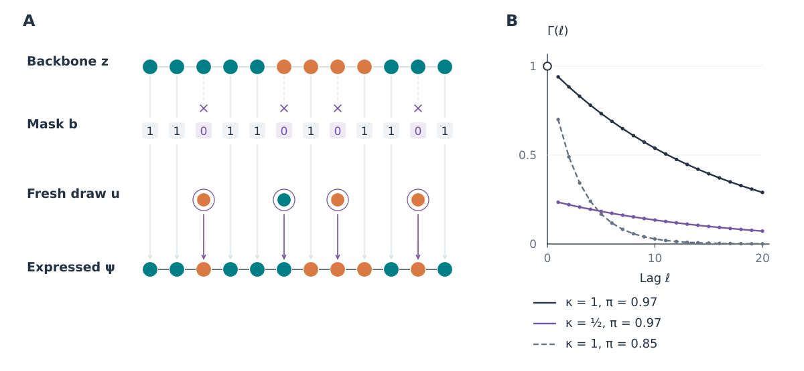
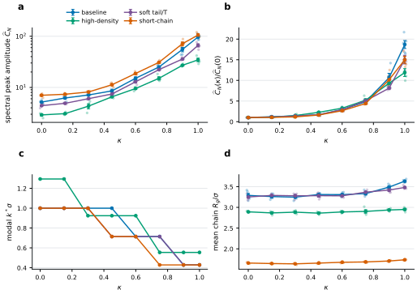
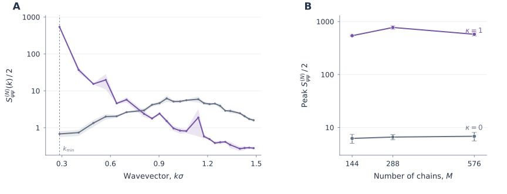
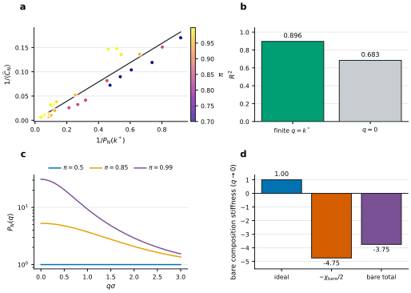
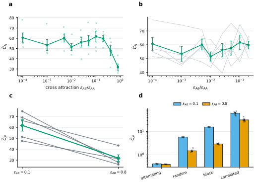

# ImpAgingSim

Code, simulation data and figure sources for the Scientific Reports manuscript
**Independent control of sequence-correlation amplitude tunes post-quench
composition fluctuations in A/B heteropolymer melts**.

The study asks how rearranging A/B labels along a polymer backbone changes
collective composition fluctuations when chemistry, mean composition, chain
length and density are held fixed. It separates the **range** of sequence
correlations from their **amplitude**, then measures the melt's late post-quench
scattering response. Follow-up studies are maintained in
[HetPoly](https://github.com/okezue/HetPoly).

[Manuscript PDF](docs/corrections/scientific_reports_rpa/pdf/Manuscript_RPA_CLEAN.pdf)
· [Supplementary Information](docs/corrections/scientific_reports_rpa/pdf/Supplementary_RPA_CLEAN.pdf)
· [Analysis and source tables](analysis/README.md)
· [Data archive](https://doi.org/10.5281/zenodo.20499120)

## Model and sequence construction

The model is a periodic melt of A/B bead–spring chains, simulated with
Langevin dynamics in OpenMM. Harmonic bonds connect adjacent monomers. Every
pair shares a WCA repulsive core; a separate attractive branch gives like
pairs a deeper attraction than A–B pairs. Changing the A–B attraction therefore
preserves excluded volume.



**Bead–spring geometry.** Teal and orange identify A and B beads. The periodic
boundary translates a chain segment by one box length. This is a schematic;
the baseline production system contains 144 chains of 40 beads.

| Baseline parameter | Value |
|---|---|
| Chains × beads per chain | 144 × 40 = 5,760 beads |
| Box length; bead density | $22\sigma$; $0.54095\sigma^{-3}$ |
| Mean composition | $f_A=0.5$ |
| Attraction depths | $\epsilon_{AA}=\epsilon_{BB}=1$, $\epsilon_{AB}=0.1$ |
| Core depth; attractive cutoff | $\epsilon_{\mathrm{core}}=1$; $2.5\sigma$ |
| Bond stiffness; rest length | $200$; $\sigma$ |
| Equilibration → quench temperature | $T^*=5\rightarrow0.7$ |
| Langevin friction; time step | $1/\tau$; $0.005\tau$ |
| Equilibration; production | 30,000; 250,000 steps |
| Stored spectra; run summary | Every 2,000 steps; mean of final five spectra |

A Markov backbone $z_i$ sets persistence through $\lambda=2\pi-1$. An
independent mask retains each backbone label with probability $\kappa$ and
otherwise redraws it at the same mean composition:
$s_i=b_i z_i+(1-b_i)u_i$. A redraw can produce the same species.



**Independent sequence controls.** For the unconditioned generator,
$\operatorname{Var}(s_i)=4f_A(1-f_A)$, while at positive contour lag
$\operatorname{Cov}(s_i,s_{i+\ell})=4f_A(1-f_A)\kappa^2\lambda^\ell$.
Thus $\pi$ sets the exponential range and $\kappa$ scales its nonzero-lag
amplitude. The plotted covariance curves are analytical illustrations.

Stochastic chains are drawn independently within their own boundaries; they
are neither copies of one sequence nor required to be unique. Their composition
is fixed in expectation. The fixed-density size comparison conditions full
chain sets on an exact global 50:50 composition. Deterministic alternating
and $A_4B_4$ controls repeat the specified sequence on every chain.

## Paper results

The main balanced-composition results use **606 static runs**: 136 in four
amplitude controls, 240 in the persistence–amplitude grid, 200 in the
sequence-class/cross-attraction comparison and 30 in the fixed-density size
series. An additional 168 off-stoichiometric runs support the supplementary
analysis of density–composition mode mixing.

For the balanced primary scans, the per-bead peak estimator is
$C_A=\max_{k\ne0}[S_{AA}^{(N)}(k)-S_{AB}^{(N)}(k)]$. Under exact A/B
exchange symmetry this equals the peak of
$[S_{AA}^{(N)}+S_{BB}^{(N)}-2S_{AB}^{(N)}]/2$; finite samples need not satisfy
$S_{AA}=S_{BB}$ exactly. Error bars use independent seeds as replicates,
rather than individual stored frames. Exported manuscript panels denote
the per-bead $C_A$ estimator by $\widehat C_N$.

### Correlation amplitude raises the composition peak



**Amplitude controls, reproduced from manuscript Fig. 2.** At $\pi=0.90$,
the late post-quench peak increases with $\kappa$ in the baseline, compressed
box, soft-tail/temperature and short-chain conditions. Run summaries average
the final five stored spectra; uncertainty is across independent seeds.

| Control | Design | Peak ratio, $\kappa=1$ / $\kappa=0$ |
|---|---|---|
| Baseline | 144 × 40 beads, $L=22\sigma$ | 18.7× |
| Higher density | Same bead count, $L=17\sigma$ | 11.9× |
| Soft tail/temperature | Attraction depths multiplied by 0.4 | 15.0× |
| Short chains | 480 × 12 beads, same bead count and volume | 15.0× |

The historical soft-control wrapper scaled temperature with
$\epsilon_{AA}$: its nominal $T^*=0.7$ was 33.676 K, compared with 84.19 K
in the baseline, while the WCA core stayed at unit depth. This control changes
both attractive depths and temperature relative to the core. Current launches
use the core as the reduced-temperature reference; reproducing the soft
control therefore requires `--T_quench 0.28 --T_equilibrate 2` with
`--lj_eps_AA 0.4 --lj_eps_BB 0.4 --lj_eps_AB 0.04`.

### The high-persistence response survives larger boxes



**Fixed-density structure.** Left: 144-chain spectra at $\pi=0.99$ and
$T^*=0.7$. Right: the condition-selected peaks across three sizes. The channel
is the total-bead-normalized $S_{\psi\psi}^{(N)}/2$, measured directly at
periodic reciprocal vectors. Bands and bars show mean ± SEM across five seeds.

| Chains $M$ | Box length $L/\sigma$ | $\kappa=0$ peak | $\kappa=1$ peak | Ratio |
|---|---|---|---|---|
| 144 | 22.000 | 6.23 ± 1.22 | 540.9 ± 13.4 | 86.9× |
| 288 | 27.718 | 6.60 ± 0.75 | 773.3 ± 58.6 | 117.2× |
| 576 | 34.923 | 6.83 ± 1.25 | 575.4 ± 39.6 | 84.3× |

Here $L=22(M/144)^{1/3}\sigma$ keeps bead density fixed. For each condition,
the shell maximizing the across-seed mean final-window spectrum is selected,
then all five seed amplitudes are evaluated at that same shell. The correlated
peak lies at $q_{\min}=2\pi/L$ in the two smaller boxes and
$\sqrt2q_{\min}$ in the largest. Its nonmonotonic amplitude and box-dependent
position leave the bulk wavelength and scaling unresolved.

### A finite-wavevector sequence statistic organizes the response

For a Gaussian reference chain with statistical segment length $b$, the
normalized intramolecular composition form factor is

$$
P_N(k)=\frac{S_0(k)}{4f_A(1-f_A)}
=1+2\kappa^2\sum_{\ell=1}^{N-1}
\left(1-\frac\ell N\right)\lambda^\ell
e^{-k^2b^2\ell/6}.
$$



**Sequence response and approximate theory, reproduced from manuscript Fig. 4.**
For the 35 active-interior conditions ($\kappa>0$, $\pi>0.5$), the
finite-$k$ inverse-response fit has $R^2=0.8956$, versus $0.6834$ for the
zero-wavevector predictor. $N=40$ and $b=\sigma$ are fixed. Each seed's
measured peak-bin centre selects the predictor wavevector, so this is a
descriptive association with the measured response. The final panel shows
the failure of the uncalibrated bare RPA closure.

The corrected two-component RPA retains both density and composition modes:
$\boldsymbol\Gamma=\boldsymbol\Omega^{-1}+B(k)\mathbf J+
\rho\beta\widetilde w(k)\mathbf E$ and
$\mathbf S_{\mathrm{RPA}}=\boldsymbol\Gamma^{-1}$ only where
$\boldsymbol\Gamma$ is positive definite. $B(k)$ is an approximate
repulsive-reference density stiffness. A/B symmetry decouples the modes and
gives $S_{\psi\psi}^{-1}=S_0^{-1}-\chi_{\mathrm{bare}}/2$ while packing
still affects density and chain conformations.

At the formal $k\rightarrow0$ limit, the baseline bare kernel gives
$\chi_{\mathrm{bare}}=9.4993$ and random-sequence composition stiffness
$-3.7496$. The closure consequently cannot supply a stable homogeneous
prediction at these parameters. Neither that diagnostic nor the empirical
regression determines the simulated melt's physical spinodal. The full
[RPA correction](docs/corrections/scientific_reports_rpa/RPA_correction_instructions.md)
includes the matrix derivation and reproducible numerical audit.

### Cross attraction gives a broad low-value plateau



**Cross-attraction comparison, reproduced from manuscript Fig. 5.** The
correlated ensemble uses $\pi=0.99$ and $\kappa=0.7$; the controls are
independent random, alternating and $A_4B_4$ sequences. Each condition has
five independent dynamical seeds. The low-attraction interval
$\epsilon_{AB}\le0.2$ has no resolved optimum (blocked permutation
$p=0.5626$). For correlated sequences, the mean $C_A$ decreases from
$61.736\pm5.254$ at $\epsilon_{AB}=0.1$ to $31.849\pm3.046$ at
$\epsilon_{AB}=0.8$; all five paired differences have the same sign
(exact two-sided sign-test $p=0.0625$).

These measurements characterize finite-time post-quench configurations.
The primary scans' first admitted radial bin mixes several reciprocal shells,
so its selected centre is a bin label and cannot define an intrinsic domain
length. Away from $f_A=1/2$, the label-difference spectrum also mixes density
and composition; the supplementary analysis explains the Bhatia–Thornton
mode required to separate them. Equilibrium phase boundaries and dynamical
aging laws require additional measurements beyond the paper's static evidence.

## Reproduce the study

Install Python dependencies and the test runner:

```bash
python3 -m pip install -r requirements.txt pytest
```

Run one baseline production condition (CUDA-capable OpenMM installation
required for `--platform CUDA`; use `CPU` or `Reference` when appropriate):

```bash
python3 -m melt.run \
  --out output/melt/demo --run_id k1 \
  --sequence correlated --kappa 1 --pi 0.99 --f_A 0.5 \
  --n_chains 144 --chain_length 40 --box_size 22 \
  --T_equilibrate 5 --T_quench 0.7 --lj_eps_AB 0.1 \
  --equilibration 30000 --n_steps 250000 --snapshot_interval 2000 \
  --compute_density --grid_size 56 --save_trajectory \
  --seed 1 --platform CUDA
```

`melt.scan` runs the original sequence, persistence–amplitude, composition
and cross-attraction grids; use `python3 -m melt.scan --help` for the grid
arguments and the supplementary tables for the exact production designs.

Plan and launch a fresh 30-run fixed-density campaign from a clean committed
checkout. Store its output outside the checkout so tracked paper outputs and
their manifests remain intact:

```bash
python3 -m melt.fixed_density_size_scan --dry-run
python3 -m melt.fixed_density_size_scan \
  --manifest-only --out ../paper-runs --campaign-id reproduction --platform CUDA
python3 -m melt.fixed_density_size_scan \
  --run --out ../paper-runs --campaign-id reproduction --platform CUDA
python3 -m melt.fixed_density_size_scan \
  --analyze --out ../paper-runs --campaign-id reproduction
```

The launcher pins code provenance, verifies completed-run checksums and skips
verified runs. `--run-index` selects a scheduler-array task. The committed
completed campaign is
[`fixed_density_pi099_v2`](output/melt/fixed_density_size/fixed_density_pi099_v2/).

Regenerate the paper figures from the committed final source tables, reproduce
the RPA audit and run the repository checks:

```bash
python3 scripts/paper/figures.py --out output/paper_figures
python3 -m scripts.submission_rpa_audit \
  --source-data analysis/paper/source_data --output /tmp/impaging-rpa
python3 -m pytest tests/ -q
```

The [final source tables](analysis/paper/README.md) are extracted from the
checksum-verified supplementary archive. The plotting script and analytical
audit need NumPy, SciPy, pandas and Matplotlib; they do not need OpenMM or a GPU.
[Figure provenance and regeneration](docs/figures/README.md) documents the
README schematics and exact manuscript exports. Paper-era AWS launch tools
are described in [`aws/README.md`](aws/README.md).

## Data availability

The paper's data are archived at
[10.5281/zenodo.20499120](https://doi.org/10.5281/zenodo.20499120).
Use the following files for the manuscript and its RPA correction:

| Archive file | Paper content |
|---|---|
| `heteropolymer_microphase_data.tar` | Production run metadata, stored spectra, snapshots and available trajectories |
| `fixed_density_campaign.tar` | Completed 30-run size comparison and the earlier execution retained for provenance |
| `Supplementary_Data_1_source_tables.zip` | Figure source and sensitivity tables, selected validation trajectories and analysis scripts |
| `Scientific_Reports_RPA_correction.zip` | Revised manuscript/supplementary sources and PDFs, corrected Fig. 4, reviewer response and numerical audit |

Download and checksum-verify only these paper files:

```bash
python3 scripts/fetch_zenodo.py --dest output/zenodo --only \
  heteropolymer_microphase_data.tar fixed_density_campaign.tar \
  Supplementary_Data_1_source_tables.zip Scientific_Reports_RPA_correction.zip
```

The source-table archive supplies the article-wide plotting scripts; the
portable copy under `scripts/paper/` reads the committed final tables.
The historical full data-rebuild script requires its original input
directories. Exact figure PDFs and corrected clean/review manuscript and
supplementary PDFs are also committed under
[`docs/corrections/scientific_reports_rpa/`](docs/corrections/scientific_reports_rpa/).
